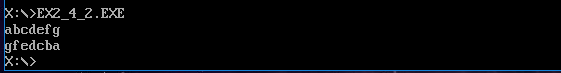

```
/*
    Zhongyuan Zheng / zhongyuan_zheng@my.cuesta.edu
    CIS 240
    Exercise 2.4 Part 2
*/
```

```
        DOSSEG                  ; Use Microsoft segment conventions
        .MODEL  SMALL           ;   conventions and small model

        .STACK  200h            ; Allocate 256-byte stack
        .DATA

        DataBuffer      DB  100 DUP(?)

        .CODE
READWRITE       PROC
        mov     ax,@DATA        ; Load segment location
        mov     ds,ax           ;   into DS register
        mov     si,OFFSET DataBuffer   ;point to storage location
WAITFORLF:
        mov     ah,1            ;read command
        int     21h             ; read one char into AL
        cmp     al,0Dh          ;test for line feed
        je EXITWAITFORLF        ;if line feed exit loop
        mov     [si],al         ;save character
        inc     si              ;point to next char
        jmp WAITFORLF           ;JMP TO WAITFORLF TOP
EXITWAITFORLF:
        mov    bx,OFFSET DataBuffer            ;set base of data tables
        sub     si,bx           ;find number of entries
        dec     si
WRITELOOPTOP:
        mov     ah,02           ;write command
        mov     dl,[bx+si]         ;get byte for write command
        int     21h             ;write to monitor
        dec     si
        jns    WRITELOOPTOP    ;JUMP TO WRITELOOPTOP
        mov     ah,4ch
        int	21h
        ret                     ;Return to DEBUG program
READWRITE       ENDP
        END
```


